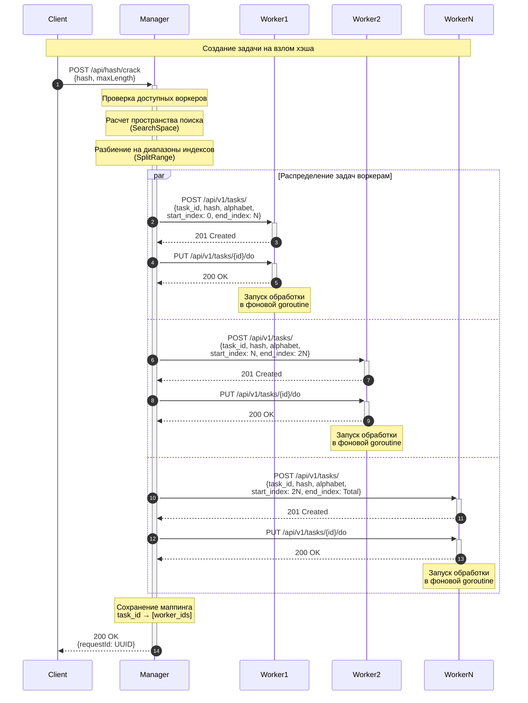
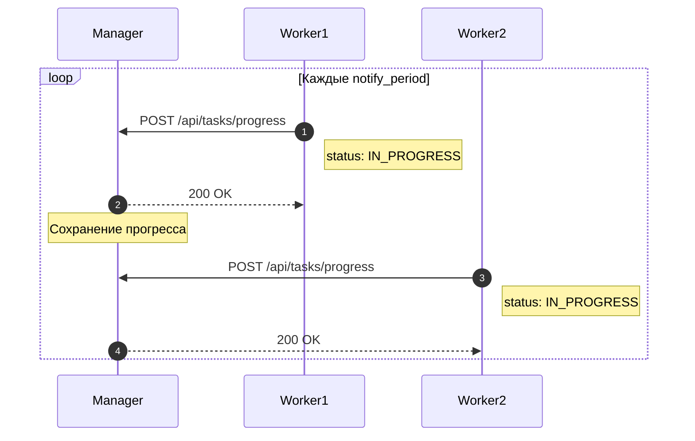
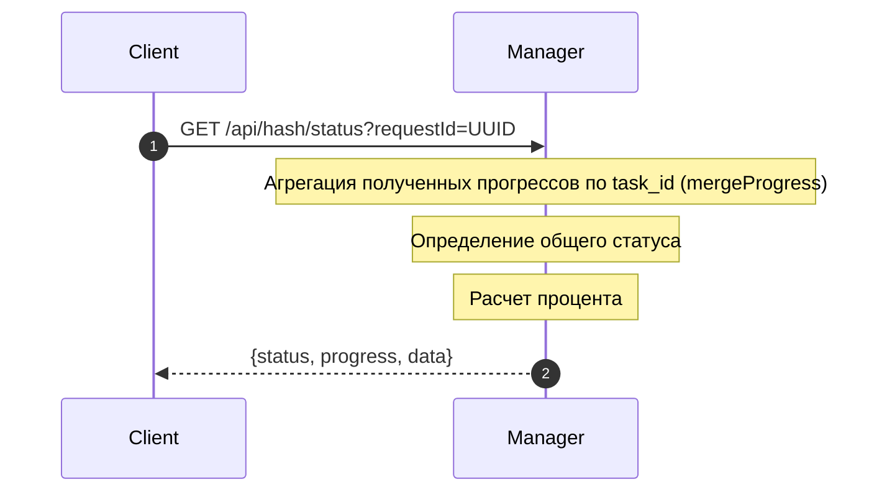
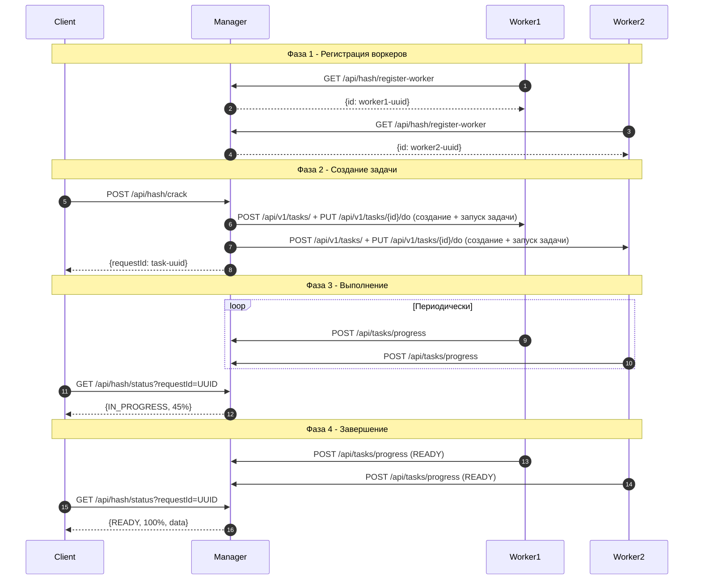
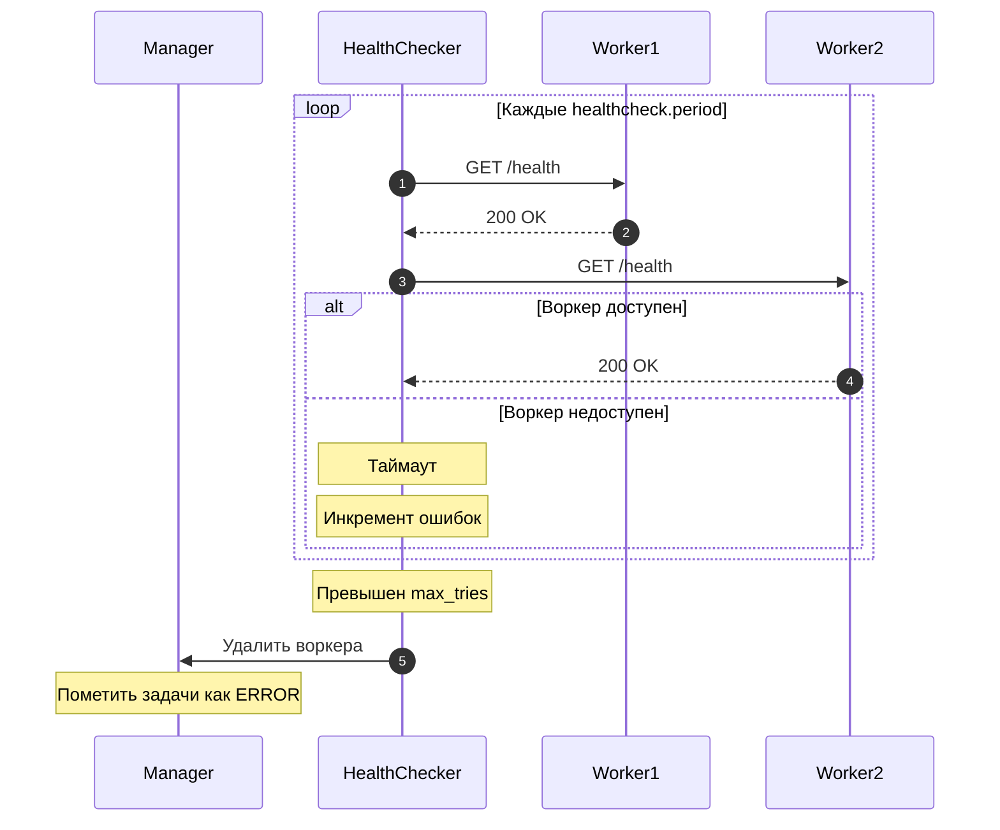

# CrackHash - Distributed Hash Cracking System

Распределённая система для взлома MD5 хэшей методом brute-force перебора.

## Описание

Система CrackHash предназначена для взлома MD5 хэшей через перебор словаря, сгенерированного на основе алфавита.
Работает по следующей логике:

1. Клиент отправляет менеджеру MD5-хэш и максимальную длину искомого слова
2. Менеджер разбивает задачу на подзадачи и распределяет между воркерами
3. Воркеры выполняют перебор слов и возвращают найденные совпадения
4. Менеджер агрегирует ответы и предоставляет клиенту результат

## Архитектура системы

Система состоит из двух типов сервисов:

### Manager (Менеджер)

- Принимает запросы от клиента на взлом хэша
- Управляет пулом воркеров (регистрация, health-check)
- Рассчитывает размер пространства поиска и разбивает его на диапазоны индексов для воркеров
- Агрегирует результаты от воркеров
- Предоставляет REST API для клиентов
- Хранит информацию о запросах в оперативной памяти с использованием потокобезопасных структур

### Worker (Воркер)

- Регистрируется в менеджере при старте
- Принимает задачи от менеджера через Internal API
- Получает полный алфавит и диапазон индексов [start_index, end_index)
- Генерирует слова итеративно по индексу (не хранит все комбинации в памяти)
- Вычисляет MD5 хэш для каждой строки
- Периодически отправляет прогресс менеджеру
- При совпадении хэша сохраняет найденное слово

## Схема взаимодействия компонентов

```
┌─────────────────────────────────────────────────────────────────────────────┐
│                                  CLIENT                                      │
│                                                                              │
│    POST /api/hash/crack         GET /api/hash/status?requestId=<UUID>       │
│    {hash, maxLength}            → {status, progress, data}                  │
└─────────────────────────────────────┬───────────────────────────────────────┘
                                      │
                                      │ External API (JSON)
                                      │
┌─────────────────────────────────────▼───────────────────────────────────────┐
│                           MANAGER SERVICE                                    │
│                              (Port 8080)                                     │
│                                                                              │
│  ┌─────────────────┐  ┌─────────────────┐  ┌─────────────────────────────┐  │
│  │ Task Management │  │ Worker Registry │  │ Progress Aggregation        │  │
│  │                 │  │                 │  │                             │  │
│  │ • Create tasks  │  │ • Registration  │  │ • Merge worker results      │  │
│  │ • Split ranges  │  │ • Health check  │  │ • Calculate total progress  │  │
│  │ • Distribute    │  │ • Failure detect│  │ • Determine final status    │  │
│  └─────────────────┘  └─────────────────┘  └─────────────────────────────┘  │
└───────────┬─────────────────────────────────────────────────┬───────────────┘
            │                                                 │
            │ Internal API                    Progress Updates│
            │ • POST /api/v1/tasks/           (push model)    │
            │ • PUT /api/v1/tasks/{id}/do                     │
            │ • DELETE /api/v1/tasks/{id}                     │
            ▼                                                 │
┌───────────────────────────────────────────────────────────────────────────────┐
│                          WORKER SERVICES (1..N)                               │
│                                                                               │
│   ┌─────────────────────┐   ┌─────────────────────┐   ┌──────────────────┐   │
│   │     Worker 1        │   │     Worker 2        │   │    Worker N      │   │
│   │  Range: [0, 1000)   │   │  Range: [1000,2000) │   │  Range: [2000,   │   │
│   │                     │   │                     │   │         3000)    │   │
│   │ • Word generation   │   │ • Word generation   │   │ • Word generation│   │
│   │ • MD5 hashing       │   │ • MD5 hashing       │   │ • MD5 hashing    │   │
│   │ • Progress notify   │   │ • Progress notify   │   │ • Progress notify│   │
│   └─────────────────────┘   └─────────────────────┘   └──────────────────┘   │
└───────────────────────────────────────────────────────────────────────────────┘
```

## Sequence Diagrams - CrackHash System

Диаграммы последовательностей, описывающие основные флоу взаимодействия компонентов системы.

## Обзор флоу

Система поддерживает три основных сценария взаимодействия:
1. **Создание задачи** - клиент отправляет запрос на взлом хэша
2. **Push прогресса** - воркеры периодически отправляют обновления менеджеру
3. **Запрос статуса** - клиент запрашивает текущий статус задачи

---

## 1. Создание задачи клиентом

Клиент отправляет запрос на взлом MD5 хэша. Менеджер распределяет задачу между доступными воркерами.



### Описание шагов

| Шаг | Действие | Описание |
|-----|----------|----------|
| 1 | POST /api/hash/crack | Клиент отправляет хэш и максимальную длину слова |
| 2-4 | Подготовка | Менеджер проверяет воркеров, рассчитывает пространство |
| 5-12 | Распределение | Отправка задач воркерам |
| 13 | Сохранение | Менеджер запоминает какие воркеры обрабатывают задачу |
| 14 | Ответ | Клиент получает UUID для отслеживания статуса |

---

## 2. Отправка прогресса воркерами (Push-модель)

Воркеры периодически отправляют обновления прогресса менеджеру через настраиваемый интервал (notify_period).



### Структура прогресса

```json
{
  "task_id": "uuid-задачи",
  "worker_id": "uuid-воркера",
  "status": "IN_PROGRESS | READY | ERROR",
  "iterations_done": 1000,
  "total_iterations": 5000,
  "result": ["найденные", "слова"]
}
```

### Возможные статусы воркера

| Статус | Описание |
|--------|----------|
| `IN_PROGRESS` | Воркер выполняет перебор |
| `READY` | Воркер завершил обработку своего диапазона |
| `ERROR` | Произошла ошибка при обработке |

---

## 3. Запрос статуса клиентом

Клиент запрашивает текущий статус задачи. Менеджер агрегирует прогресс от всех воркеров.



### Варианты ответа

**IN_PROGRESS** - задача выполняется:
```json
{
  "status": "IN_PROGRESS",
  "progress": 65,
  "data": null
}
```

**READY** - все воркеры завершили:
```json
{
  "status": "READY",
  "progress": 100,
  "data": ["abcd"]
}
```

**ERROR** - хотя бы один воркер упал:
```json
{
  "status": "ERROR",
  "progress": 50,
  "data": null
}
```
---

## 4. Полный жизненный цикл

Комплексная диаграмма всего процесса от создания до получения результата.



---

## 5. Health Check и обработка падения воркера



## Описание API

### External API (Manager) - для клиентов

#### POST /api/hash/crack

Создание запроса на взлом хэша.

**Request:**

```json
{
  "hash": "e2fc714c4727ee9395f324cd2e7f331f",
  "maxLength": 4
}
```

**Response (200 OK):**

```json
{
  "requestId": "0160c0ac-5c32-4145-ac08-0ff3f9042401"
}
```

**Status Codes:**

- `200 OK` - запрос принят
- `400 Bad Request` - неверный формат запроса
- `500 Internal Server Error` - нет доступных воркеров или внутренняя ошибка

---

#### GET /api/hash/status?requestId=0160c0ac-5c32-4145-ac08-0ff3f9042401

Получение статуса выполнения запроса.

**Parameters:**

- `requestId` - UUID запроса, полученный при создании

**Response (IN_PROGRESS):**

```json
{
  "status": "IN_PROGRESS",
  "progress": 65,
  "data": null
}
```

**Response (READY):**

```json
{
  "status": "READY",
  "progress": 100,
  "data": [
    "abcd"
  ]
}
```

**Response (ERROR):**

```json
{
  "status": "ERROR",
  "progress": 50,
  "data": null
}
```
---

### Internal API (Manager) - для воркеров

#### GET /api/hash/register-worker

Регистрация воркера в системе.

**Headers:**

- `X-Worker-Port` - порт HTTP-сервера воркера

**Response (200 OK):**

```json
{
  "id": "0160c0ac-5c32-4145-ac08-0ff3f9042401"
}
```

---

#### POST /api/tasks/progress

Получение обновления прогресса от воркера.

**Request:**

```json
{
  "task_id": "0160c0ac-5c32-4145-ac08-0ff3f9042401",
  "worker_id": "0320c0ac-5c32-4145-ac08-0ff3f9042401",
  "status": "IN_PROGRESS",
  "iterations_done": 5000,
  "total_iterations": 10000,
  "result": []
}
```

---

### Internal API (Worker) - для менеджера

Полная документация доступна в `docs/worker-api-openapi.yaml` (Swagger/OpenAPI).

#### POST /api/v1/tasks/

Создание задачи на воркере.

**Request:**

```json
{
  "task_id": "0160c0ac-5c32-4145-ac08-0ff3f9042401",
  "target_hash": "e2fc714c4727ee9395f324cd2e7f331f",
  "alphabet": "abcdefghijklmnopqrstuvwxyz0123456789",
  "max_length": 4,
  "start_index": 0,
  "end_index": 500000
}
```

#### PUT /api/v1/tasks/{task_id}/do

Запуск выполнения задачи.

#### DELETE /api/v1/tasks/{task_id}

Удаление задачи.

#### GET /health

Проверка работоспособности воркера.

## Конфигурационные параметры

### Manager (configs/manager.yaml)

```yaml
http:
  port: 8080                    # Порт HTTP сервера

logger:
  level: "info"                 # Уровень логирования (debug, info, warn, error)
  is_json: false                # Формат логов (true = JSON, false = текст)

healthcheck:
  period: 10s                   # Период проверки здоровья воркеров
  max_tries: 5                  # Максимальное количество неудачных попыток до пометки воркера как недоступного

hash_cracker:
  alphabet: "abcdefghijklmnopqrstuvwxyz0123456789"  # Алфавит для перебора (a-z, 0-9)
```

### Worker (configs/worker.yaml)

```yaml
http:
  port: 8080                    # Порт HTTP сервера

logger:
  level: "info"                 # Уровень логирования
  is_json: false                # Формат логов

registerer:
  register_url: "http://manager-service:8080/api/hash/register-worker"  # URL для регистрации в менеджере

notifier:
  notify_url: "http://manager-service:8080/api/tasks/progress"  # URL для отправки прогресса

workers:
  max_parallel: 10              # Максимальное количество параллельных задач
  notify_period: 1s             # Период отправки обновлений прогресса
```

## Алфавит и пространство перебора

- **Алфавит:** конфигурируется
- **Длина строк:** от 1 до `maxLength` включительно
- **Размер пространства:** для алфавита размера N и максимальной длины L: N + N² + ... + Nᴸ

**Распределение по диапазонам индексов:**

Менеджер рассчитывает общий размер пространства поиска и делит его на примерно равные диапазоны индексов.

**Пример для maxLength=2 и 3 воркеров:**

Общее пространство: 36 + 36² = 1332 слова (индексы 0-1331)

- Worker 1: индексы [0, 444) — 444 слова
- Worker 2: индексы [444, 888) — 444 слова
- Worker 3: индексы [888, 1332) — 444 слова

Каждый воркер получает **полный алфавит** и свой диапазон индексов. SearchSpace преобразует индекс в соответствующее слово:

- Индекс 0 → "a"
- Индекс 35 → "9"
- Индекс 36 → "aa"
- Индекс 1331 → "99"

## Логирование

Система использует структурированное логирование с помощью `log/slog`. Логи включают:

- **Приём запросов от клиента** - создание задачи, запрос статуса
- **Регистрацию воркеров** - IP-адрес, порт, UUID
- **Распределение задач** - какой воркер получил какой диапазон индексов
- **Процесс выполнения** - прогресс, найденные совпадения
- **Формирование результата** - агрегация от всех воркеров
- **Ошибки** - недоступность воркеров, таймауты, panic recovery

## Архитектурные решения

1. **Push-модель для прогресса:** Воркеры периодически отправляют обновления менеджеру (вместо pull-модели с polling)

2. **Распределение по диапазонам индексов:** Менеджер рассчитывает общий размер пространства поиска и делит его на равные диапазоны между воркерами. Каждый воркер получает полный алфавит и свой диапазон индексов для перебора.

3. **SearchSpace индексация:** Воркеры используют структуру SearchSpace для эффективного преобразования индекса в слово. Это гарантирует полное покрытие пространства поиска без пропусков.

4. **Health Checking:** Менеджер периодически проверяет здоровье воркеров. При падении воркера его задачи помечаются как ERROR

5. **Потокобезопасность:** Все данные о запросах и воркерах хранятся в памяти с использованием `sync.RWMutex` и `atomic` операций

6. **Итеративная генерация:** Воркеры генерируют слова итеративно по индексу без хранения всех комбинаций в памяти

7. **Graceful degradation:** При падении части воркеров система продолжает работать с оставшимися, помечая задачи упавших как ERROR

## OpenAPI документация

- Manager API: `docs/manager-api-openapi.yaml`
- Worker API: `docs/worker-api-openapi.yaml`

Для просмотра документации можно использовать [Swagger Editor](https://editor.swagger.io/)
или [Swagger UI](https://swagger.io/tools/swagger-ui/).